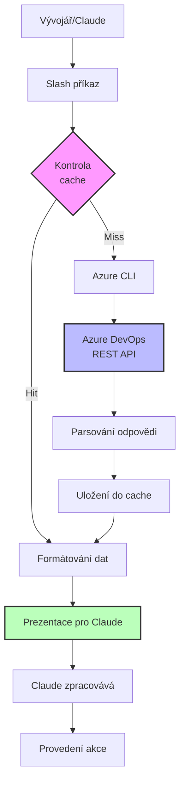
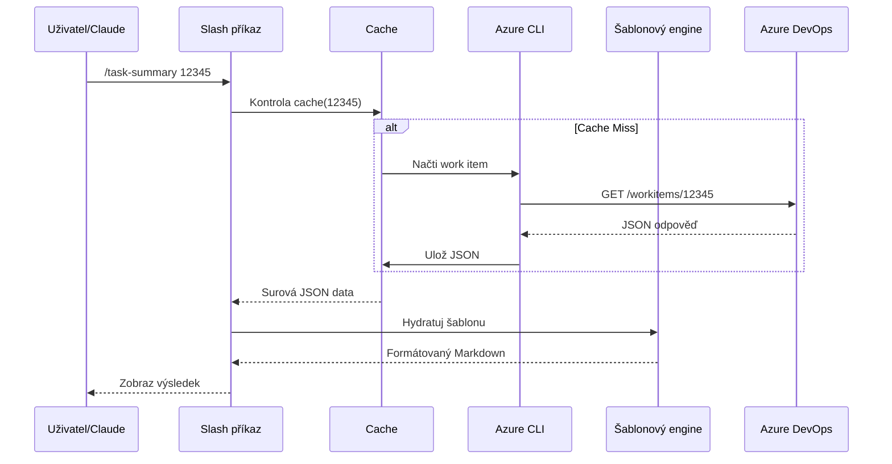
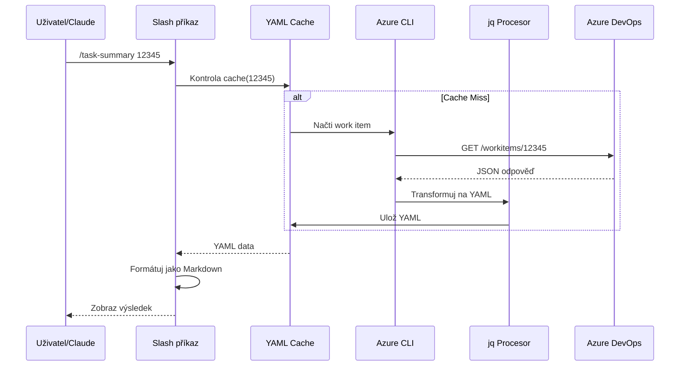
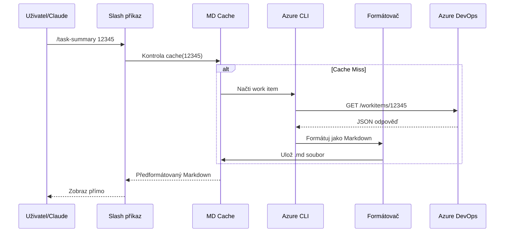
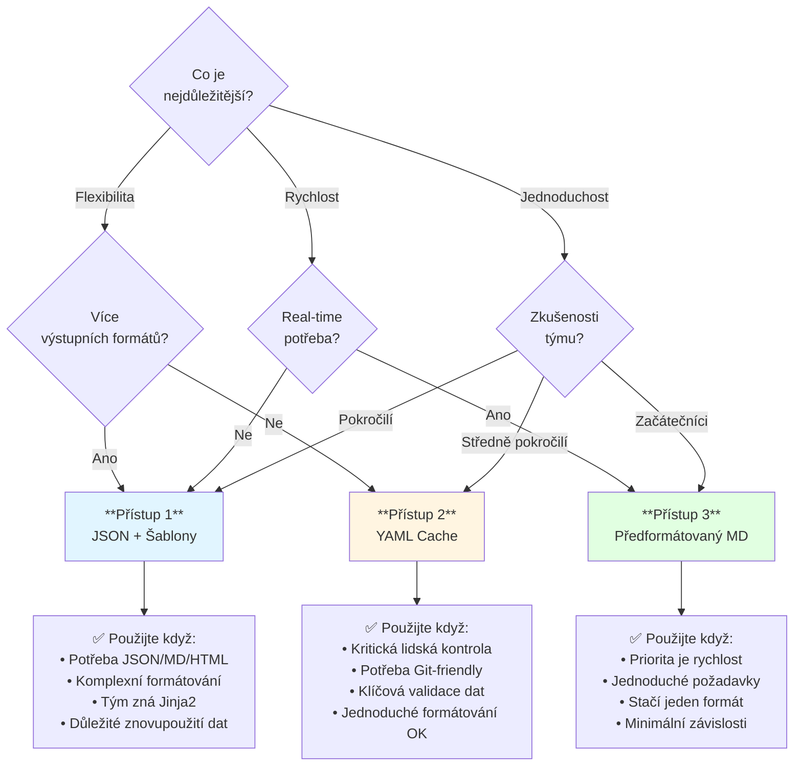
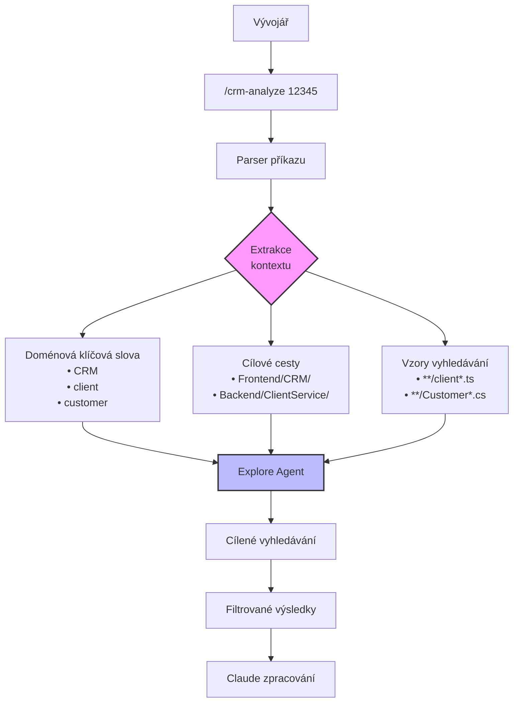

# Přístupy k integraci Azure DevOps pro Claude Code

> Komplexní průvodce integrací Azure DevOps work items se slash příkazy v Claude Code

## Obsah

1. [Shrnutí](#shrnutí)
2. [Výukové cíle](#výukové-cíle)
3. [Přehled architektury](#přehled-architektury)
4. [Přístup 1: CLI + JSON Cache s hydratací šablon](#přístup-1-cli--json-cache-s-hydratací-šablon)
5. [Přístup 2: CLI + YAML s člověkem čitelnou cache](#přístup-2-cli--yaml-s-člověkem-čitelnou-cache)
6. [Přístup 3: Předformátovaná Markdown cache](#přístup-3-předformátovaná-markdown-cache)
7. [Srovnání a rozhodovací průvodce](#srovnání-a-rozhodovací-průvodce)
8. [Příklady implementace](#příklady-implementace)
9. [Osvědčené postupy](#osvědčené-postupy)
10. [Průvodce řešením problémů](#průvodce-řešením-problémů)
11. [Kontextově orientované vyhledávání v kódu pomocí agentů](#kontextově-orientované-vyhledávání-v-kódu-pomocí-agentů)
12. [Reference](#reference)

---

## Shrnutí

Při integraci Azure DevOps s Claude Code je potřeba zvolit přístup, který vyvažuje:
- **Vývojářský zážitek (DX)**: Jak snadné je číst a rozumět datům
- **AI zpracování**: Jak dobře Claude dokáže parsovat a využít data
- **Výkon**: Rychlost získávání a zpracování dat
- **Udržovatelnost**: Snadnost aktualizací a ladění

Tento dokument prozkoumává tři odlišné přístupy, každý s různými kompromisy:

| Přístup | DX skóre | AI skóre | Rychlost | Vhodné pro |
|---------|----------|----------|----------|------------|
| JSON + Šablony | ⭐⭐⭐ | ⭐⭐⭐⭐⭐ | ⚡⚡⚡ | Komplexní data, více formátů |
| YAML + Cache | ⭐⭐⭐⭐⭐ | ⭐⭐⭐⭐ | ⚡⚡ | Lidská kontrola, Git-friendly |
| Předformátovaný MD | ⭐⭐⭐⭐ | ⭐⭐⭐ | ⚡⚡⚡ | Jednoduché případy, priorita rychlosti |

---

## Výukové cíle

Po přečtení tohoto dokumentu budete schopni:

✅ Pochopit tok dat z Azure DevOps API do Claude Code
✅ Rozlišovat mezi třemi integračními přístupy
✅ Vybrat správný přístup pro potřeby vašeho projektu
✅ Implementovat zvolený přístup s poskytnutými příklady kódu
✅ Řešit běžné integrační problémy
✅ Optimalizovat výkon a udržovatelnost

---

## Přehled architektury

### Systémový diagram vysoké úrovně



### Základní komponenty

```
┌─────────────────────────────────────────────────────────────┐
│                    Integrace Azure DevOps                    │
├─────────────────────────────────────────────────────────────┤
│                                                               │
│  ┌──────────────┐      ┌──────────────┐      ┌───────────┐ │
│  │  CLI vrstva  │──────│ Cache vrstva │──────│  Šablony  │ │
│  │              │      │              │      │   vrstva  │ │
│  │ • az boards  │      │ • Souborová  │      │ • Jinja2  │ │
│  │ • jq filtr   │      │ • TTL správa │      │ • Markdown│ │
│  └──────────────┘      └──────────────┘      └───────────┘ │
│         │                      │                     │       │
│         └──────────────────────┴─────────────────────┘       │
│                              │                                │
│                     ┌────────▼────────┐                      │
│                     │  Slash příkaz   │                      │
│                     │   Vstupní bod   │                      │
│                     └─────────────────┘                      │
└─────────────────────────────────────────────────────────────┘
```

---

## Přístup 1: CLI + JSON Cache s hydratací šablon

### Přehled

Tento přístup používá Azure CLI k získání surových JSON dat, ukládá je lokálně do cache a využívá Jinja2 šablony k jejich formátování pro prezentaci.

### Architektura



### Vizualizace toku dat

```
┌─────────────┐
│ Azure CLI   │
│ Dotaz       │
└──────┬──────┘
       │
       │ Surový JSON
       ▼
┌─────────────┐
│ JSON Cache  │  ◄── Kontrola TTL (výchozí 15min)
│ .cache/     │
│ 12345.json  │
└──────┬──────┘
       │
       │ Strukturovaná data
       ▼
┌─────────────┐      ┌──────────────┐
│  Šablonový  │◄─────│ Knihovna     │
│  engine     │      │ šablon       │
│  (Jinja2)   │      │ • summary.md │
└──────┬──────┘      │ • full.md    │
       │             │ • compact.md │
       │             └──────────────┘
       │ Vyrenderovaný Markdown
       ▼
┌─────────────┐
│  Claude     │
│  Prompt     │
└─────────────┘
```

### Ukázková struktura JSON cache

```json
{
  "id": 12345,
  "rev": 42,
  "fields": {
    "System.WorkItemType": "Task",
    "System.State": "Active",
    "System.Title": "Implementace integrace Azure DevOps",
    "System.AssignedTo": {
      "displayName": "Jan Novák",
      "uniqueName": "jan.novak@spolecnost.cz"
    },
    "System.Description": "<div>Detailní HTML popis...</div>",
    "System.Tags": "integrace; devops; api",
    "Microsoft.VSTS.Common.Priority": 2,
    "System.CreatedDate": "2025-01-15T10:30:00Z",
    "System.ChangedDate": "2025-01-16T14:20:00Z"
  },
  "relations": [
    {
      "rel": "System.LinkTypes.Hierarchy-Reverse",
      "url": "https://dev.azure.com/.../workItems/12000",
      "attributes": {
        "name": "Parent"
      }
    }
  ],
  "_metadata": {
    "cached_at": "2025-01-16T15:00:00Z",
    "ttl_seconds": 900,
    "api_version": "7.0"
  }
}
```

### Ukázková Jinja2 šablona

```jinja2
# 📋 Work Item #{{ id }}

**{{ fields['System.Title'] }}**

---

## Základní informace

| Pole | Hodnota |
|------|---------|
| Typ | {{ fields['System.WorkItemType'] }} |
| Stav | {{ fields['System.State'] }} |
| Priorita | {{ fields['Microsoft.VSTS.Common.Priority'] }} |
| Přiřazeno | {{ fields['System.AssignedTo'].displayName }} |
| Vytvořeno | {{ fields['System.CreatedDate'] | format_date }} |
| Aktualizováno | {{ fields['System.ChangedDate'] | format_date }} |


**Štítky**: {{ fields['System.Tags'] }}


---

## Popis

{{ fields['System.Description'] | strip_html | default('Popis není k dispozici.') }}

---


## Související položky


- **{{ relation.attributes.name }}**: [#{{ relation.url | extract_id }}]({{ relation.url }})



---

*Vygenerováno: {{ _metadata.cached_at | format_date }}*
```

### Bash implementace

```bash
#!/bin/bash

TASK_ID="$1"
CACHE_DIR=".cache/workitems"
TEMPLATE_DIR=".templates/workitems"
CACHE_FILE="${CACHE_DIR}/${TASK_ID}.json"
TTL_SECONDS=900  # 15 minut

# Zajištění existence adresáře cache
mkdir -p "$CACHE_DIR"

# Kontrola platnosti cache
is_cache_valid() {
    if [[ ! -f "$CACHE_FILE" ]]; then
        return 1
    fi

    local cached_at=$(jq -r '._metadata.cached_at' "$CACHE_FILE")
    local cached_timestamp=$(date -d "$cached_at" +%s 2>/dev/null || date -j -f "%Y-%m-%dT%H:%M:%SZ" "$cached_at" +%s)
    local current_timestamp=$(date +%s)
    local age=$((current_timestamp - cached_timestamp))

    [[ $age -lt $TTL_SECONDS ]]
}

# Načtení z Azure DevOps
fetch_workitem() {
    local response=$(az boards work-item show \
        --id "$TASK_ID" \
        --org "$AZURE_DEVOPS_ORG_URL" \
        --output json)

    # Přidání metadat
    local enhanced=$(echo "$response" | jq '. + {
        "_metadata": {
            "cached_at": (now | strftime("%Y-%m-%dT%H:%M:%SZ")),
            "ttl_seconds": '$TTL_SECONDS',
            "api_version": "7.0"
        }
    }')

    echo "$enhanced" > "$CACHE_FILE"
    echo "$enhanced"
}

# Získání work item (z cache nebo API)
get_workitem() {
    if is_cache_valid; then
        cat "$CACHE_FILE"
    else
        fetch_workitem
    fi
}

# Renderování šablony
render_template() {
    local data="$1"
    local template="${TEMPLATE_DIR}/summary.md.j2"

    # Použití Pythonu pro Jinja2 renderování
    python3 <<EOF
import json
import sys
from jinja2 import Template, Environment
from datetime import datetime

# Vlastní filtry
def format_date(date_str):
    dt = datetime.fromisoformat(date_str.replace('Z', '+00:00'))
    return dt.strftime('%Y-%m-%d %H:%M')

def strip_html(html):
    from html.parser import HTMLParser
    class MLStripper(HTMLParser):
        def __init__(self):
            super().__init__()
            self.text = []
        def handle_data(self, d):
            self.text.append(d)
        def get_data(self):
            return ''.join(self.text)
    s = MLStripper()
    s.feed(html)
    return s.get_data()

def extract_id(url):
    return url.split('/')[-1]

# Nastavení prostředí
env = Environment()
env.filters['format_date'] = format_date
env.filters['strip_html'] = strip_html
env.filters['extract_id'] = extract_id

# Načtení dat a šablony
data = json.loads('''$data''')
with open('$template', 'r') as f:
    template = env.from_string(f.read())

# Renderování
print(template.render(**data))
EOF
}

# Hlavní spuštění
main() {
    local workitem_json=$(get_workitem)
    render_template "$workitem_json"
}

main
```

### Výhody a nevýhody

#### ✅ Výhody

1. **Oddělení zodpovědností**: Získávání dat, cachování a prezentace jsou nezávislé
2. **Více výstupních formátů**: Snadné vytvoření různých šablon (souhrn, plný, JSON)
3. **Bohaté transformace**: Plná síla Jinja2 pro komplexní formátování
4. **Znovupoužitelnost cache**: Stejný JSON může napájet více šablon
5. **Přívětivost pro správu verzí**: Šablony lze sledovat a kontrolovat v Gitu

#### ❌ Nevýhody

1. **Další závislost**: Vyžaduje Python + Jinja2
2. **Složitost**: Více pohyblivých částí k údržbě
3. **Křivka učení**: Tým musí znát syntaxi Jinja2
4. **Obtížné ladění**: Chyby šablon mohou být kryptické

---

## Přístup 2: CLI + YAML s člověkem čitelnou cache

### Přehled

Tento přístup načítá data z Azure DevOps, transformuje je do čisté YAML struktury a ukládá je do cache v člověkem čitelném formátu.

### Architektura



### Vizualizace toku dat

```
┌─────────────┐
│ Azure CLI   │
│   Požadavek │
└──────┬──────┘
       │
       │ Surový JSON
       ▼
┌─────────────┐
│ jq Parser   │
│ + yq konv.  │
└──────┬──────┘
       │
       │ Strukturovaný YAML
       ▼
┌─────────────────────────────────┐
│      YAML Cache soubor          │
│  .cache/workitems/12345.yml     │
│                                 │
│  ---                            │
│  id: 12345                      │
│  title: "Název úkolu"           │
│  type: Task                     │
│  state: Active                  │
│  assigned_to:                   │
│    name: Jan Novák              │
│    email: jan@spolecnost.cz     │
│  description: |                 │
│    Víceřádkový popis            │
│    se zachovaným formátováním   │
│  tags:                          │
│    - integrace                  │
│    - devops                     │
│  metadata:                      │
│    cached_at: 2025-01-16T15:00  │
│    ttl: 900                     │
│  ---                            │
└────────┬────────────────────────┘
         │
         │ Parsování YAML
         ▼
┌─────────────┐
│ Bash skript │
│  Formátovat │
│  na Markdown│
└──────┬──────┘
       │
       │ Formátovaný výstup
       ▼
┌─────────────┐
│   Claude    │
│   Prompt    │
└─────────────┘
```

### Ukázková struktura YAML cache

```yaml
---
id: 12345
revision: 42
url: https://dev.azure.com/org/project/_workitems/edit/12345

# Základní pole
type: Task
state: Active
title: "Implementace integrace Azure DevOps"
priority: 2

# Osoby
assigned_to:
  name: Jan Novák
  email: jan.novak@spolecnost.cz
  unique_name: jan.novak@spolecnost.cz

created_by:
  name: Jana Nováková
  email: jana.novakova@spolecnost.cz

# Datumy
created_date: 2025-01-15T10:30:00Z
changed_date: 2025-01-16T14:20:00Z
closed_date: null

# Obsah
description: |
  Tento úkol zahrnuje implementaci robustní integrace Azure DevOps,
  která podporuje více strategií cachování a výstupních formátů.

  ## Požadavky
  - Podpora JSON, YAML a Markdown cachování
  - Implementace invalidace cache založené na TTL
  - Vytvoření znovupoužitelných šablon

  ## Akceptační kritéria
  - Všechny tři přístupy zdokumentovány
  - Výkonové benchmarky dokončeny
  - Unit testy procházejí

# Kategorizace
tags:
  - integrace
  - devops
  - api

area_path: "Projekt\\Integrace"
iteration_path: "Projekt\\Sprint 12"

# Relace
parent:
  id: 12000
  title: "DevOps Integration Epic"
  type: Epic

children: []

related_work: []

# Vlastní pole
effort: 8
remaining_work: 4
completed_work: 4

# Metadata
metadata:
  cached_at: 2025-01-16T15:00:00Z
  ttl_seconds: 900
  api_version: "7.0"
  cache_version: "1.0"
---
```

### Výhody a nevýhody

#### ✅ Výhody

1. **Člověkem čitelná cache**: YAML soubory jsou snadno kontrolovatelné a laditelné
2. **Přívětivost pro Git**: Čisté diffy ve správě verzí
3. **Samo-dokumentující**: Struktura YAML je intuitivní
4. **Přímé editace**: V případě potřeby lze cache ručně opravit
5. **Žádný šablonový engine**: Jednodušší řetězec závislostí
6. **Validace dat**: yq poskytuje validaci schématu

#### ❌ Nevýhody

1. **Závislost na YAML**: Vyžaduje nástroj yq
2. **Omezené formátování**: Těžší vytvoření komplexních rozvržení
3. **Výkonová režie**: Konverze JSON→YAML→Markdown
4. **Problémy s escapováním**: Speciální znaky YAML vyžadují pečlivé zacházení

---

## Přístup 3: Předformátovaná Markdown cache

### Přehled

Tento přístup načítá data z Azure DevOps a okamžitě je formátuje jako Markdown před cachováním, čímž eliminuje potřebu šablon nebo post-zpracování.

### Architektura



### Vizualizace toku dat

```
┌─────────────┐
│ Azure CLI   │
│   Požadavek │
└──────┬──────┘
       │
       │ Surový JSON
       ▼
┌──────────────────────┐
│   jq + Bash          │
│   Markdown generátor │
│                      │
│   • Extrakce polí    │
│   • Formát tabulek   │
│   • Přidání metadat  │
│   • Stavba struktury │
└──────┬───────────────┘
       │
       │ Plně formátovaný Markdown
       ▼
┌────────────────────────────────────┐
│   Markdown Cache soubor            │
│   .cache/workitems/12345.md        │
│                                    │
│   # 📋 Work Item #12345            │
│   **Implementuj Azure integraci**  │
│   ---                              │
│   ## Základní informace            │
│   | Pole  | Hodnota |              │
│   |-------|---------|              │
│   | Typ   | Task    |              │
│   ...                              │
│   <!--metadata                     │
│   cached_at: 2025-01-16T15:00      │
│   ttl: 900                         │
│   -->                              │
└────────┬───────────────────────────┘
         │
         │ Přímé čtení (cat)
         ▼
┌─────────────┐
│   Claude    │
│   Prompt    │
└─────────────┘
```

### Výhody a nevýhody

#### ✅ Výhody

1. **Nejrychlejší získání**: Nepotřeba post-zpracování
2. **Nejjednodušší architektura**: Minimální závislosti
3. **Přímé zobrazení**: Claude dostává obsah připravený k použití
4. **Snadné ladění**: Člověkem čitelné cache soubory
5. **Žádná složitost šablon**: Jednoprochodové generování
6. **Optimální pro Claude**: Formát odpovídá preferovanému vstupu Claude

#### ❌ Nevýhody

1. **Uzamčení formátu**: Těžké změnit výstupní formát bez regenerace
2. **Redundantní úložiště**: Stejná data nemohou sloužit více formátům
3. **Těžší aktualizace**: Změna rozvržení vyžaduje úpravu skriptu
4. **Omezená znovupoužitelnost**: Nelze snadno extrahovat surová data
5. **Šum ve správě verzí**: Velké diffy pro malé změny dat

---

## Srovnání a rozhodovací průvodce

### Matice srovnání funkcí

| Funkce | JSON + Šablony | YAML + Cache | Předformát. MD |
|--------|---------------|--------------|----------------|
| **Výkon** |
| Počáteční načtení | ⚡⚡ Střední | ⚡ Pomalejší | ⚡⚡⚡ Rychlé |
| Čtení z cache | ⚡⚡ Střední | ⚡⚡ Střední | ⚡⚡⚡ Okamžité |
| Doba zpracování | ⚡ Pomalejší | ⚡⚡ Střední | ⚡⚡⚡ Žádná |
| **Flexibilita** |
| Více formátů | ✅ Výborné | ⚠️ Střední | ❌ Jeden |
| Vlastní rozvržení | ✅ Výborné | ⚠️ Omezené | ❌ Pevné |
| Extrakce dat | ✅ Snadná | ✅ Snadná | ❌ Obtížná |
| Aktualizace šablon | ✅ Bez refetch | ⚠️ Nutný skript | ❌ Plný refetch |
| **Udržovatelnost** |
| Složitost kódu | ⚠️ Vysoká | ⚡⚡ Střední | ⚡⚡⚡ Nízká |
| Závislosti | Python, Jinja2, jq | yq, jq | pouze jq |
| Ladění | ⚠️ Vícevrstvé | ⚡⚡ Jasné | ⚡⚡⚡ Jednoduché |
| Křivka učení | ⚠️ Strmá | ⚡⚡ Střední | ⚡⚡⚡ Snadná |
| **Vývojářský zážitek** |
| Kontrola cache | ⚠️ Surový JSON | ✅ Čitelný YAML | ✅ Formátovaný MD |
| Git diffy | ⚠️ Šumné | ✅ Čisté | ⚠️ Velké |
| Ruční úpravy | ❌ Rizikové | ✅ Možné | ⚠️ Rozbije cache |
| Dokumentace | ⚠️ Externí | ✅ Samo-dok. | ✅ Samo-dok. |
| **AI integrace** |
| Parsování Claude | ✅ Výborné | ✅ Dobré | ✅ Perfektní |
| Efektivita tokenů | ✅ Nejlepší | ⚡⚡ Dobrá | ⚠️ Upovídaná |
| Kontextové okno | ✅ Kompaktní | ⚡⚡ Střední | ⚠️ Velké |
| Prompt engineering | ✅ Flexibilní | ⚡⚡ Střední | ⚡⚡⚡ Jednoduché |

### Rozhodovací strom



### Doporučení podle případu použití

#### Zvolte **Přístup 1 (JSON + Šablony)** když:

✅ Potřebujete více výstupních formátů (souhrn, plný, JSON API)
✅ Jsou vyžadovány komplexní transformace dat
✅ Tým je pohodlný se šablonovými jazyky
✅ Chcete oddělit data od prezentace
✅ Různí spotřebitelé potřebují různé pohledy
✅ Data budou použita v jiných systémech

**Příklady scénářů:**
- Více-kanálové notifikace (Slack, email, web)
- API endpointy sloužící různým klientům
- Reporty v různých formátech (PDF, HTML, prostý text)

#### Zvolte **Přístup 2 (YAML + Cache)** když:

✅ Kritická je lidská čitelnost
✅ Cache soubory budou kontrolovány v PR
✅ Potřebujete validaci dat
✅ Tým preferuje YAML před JSON
✅ Git diffy musí být čisté
✅ Je potřeba ruční úprava cache

**Příklady scénářů:**
- Dokumentační workflow
- Správa konfigurace
- Auditní stopy
- Kolaborativní prostředí

#### Zvolte **Přístup 3 (Předformátovaný MD)** když:

✅ Rychlost je hlavní prioritou
✅ Postačuje jeden výstupní formát
✅ Požadované minimální závislosti
✅ Tým chce jednoduchost
✅ Claude je primárním spotřebitelem
✅ Potřeba rychlého prototypování

**Příklady scénářů:**
- MVP/proof of concept
- Nástroje osobní produktivity
- Jednoduché dashboardy
- Výukové projekty

---

## Příklady implementace

### Příklad 1: Integrace slash příkazu

#### Implementace přístupu 1

```bash
#!/bin/bash
# .claude/commands/task-summary.sh

# Popis: Načti a zobraz souhrn Azure DevOps work item
# Použití: /task-summary [TASK_ID]

TASK_ID="$1"

if [[ -z "$TASK_ID" ]]; then
    echo "❌ Chyba: Vyžadováno ID úkolu"
    echo "Použití: /task-summary [TASK_ID]"
    exit 1
fi

# Načtení knihovny
source "$(dirname "$0")/../lib/azure-devops.sh"

# Načtení work item (použije cache pokud je platná)
workitem_json=$(get_workitem "$TASK_ID")

# Renderování pomocí summary šablony
render_template "$workitem_json" "summary"
```

#### Implementace přístupu 2

```bash
#!/bin/bash
# .claude/commands/task-summary.sh

TASK_ID="$1"
CACHE_FILE=".cache/workitems/${TASK_ID}.yml"

if [[ -z "$TASK_ID" ]]; then
    echo "❌ Chyba: Vyžadováno ID úkolu"
    exit 1
fi

# Načtení knihovny
source "$(dirname "$0")/../lib/azure-devops-yaml.sh"

# Zajištění čerstvosti cache
if ! is_cache_valid "$CACHE_FILE"; then
    fetch_workitem_yaml "$TASK_ID"
fi

# Formátování a zobrazení
format_yaml_as_markdown "$CACHE_FILE"
```

#### Implementace přístupu 3

```bash
#!/bin/bash
# .claude/commands/task-summary.sh

TASK_ID="$1"
CACHE_FILE=".cache/workitems/${TASK_ID}.md"

if [[ -z "$TASK_ID" ]]; then
    echo "❌ Chyba: Vyžadováno ID úkolu"
    exit 1
fi

# Načtení knihovny
source "$(dirname "$0")/../lib/azure-devops-md.sh"

# Zajištění čerstvosti cache
if ! is_cache_valid "$CACHE_FILE"; then
    fetch_workitem_markdown "$TASK_ID"
fi

# Přímé zobrazení
cat "$CACHE_FILE"
```

### Příklad 2: Více-formátový výstup

#### Možné pouze s přístupem 1

```bash
#!/bin/bash
# .claude/commands/task-export.sh

TASK_ID="$1"
FORMAT="${2:-summary}"  # summary, full, json, compact

# Jednorázové načtení
workitem_json=$(get_workitem "$TASK_ID")

case "$FORMAT" in
    "summary")
        render_template "$workitem_json" "summary"
        ;;
    "full")
        render_template "$workitem_json" "full"
        ;;
    "json")
        echo "$workitem_json" | jq '.'
        ;;
    "compact")
        render_template "$workitem_json" "compact"
        ;;
    *)
        echo "Neznámý formát: $FORMAT"
        exit 1
        ;;
esac
```

### Příklad 3: Správa cache

```bash
#!/bin/bash
# scripts/cache-manager.sh

CACHE_DIR=".cache/workitems"

# Vymazání expirovaných cache
clear_expired() {
    local now=$(date +%s)

    find "$CACHE_DIR" -type f | while read -r file; do
        if [[ "$file" == *.json ]]; then
            local cached_at=$(jq -r '._metadata.cached_at' "$file")
            local ttl=$(jq -r '._metadata.ttl_seconds' "$file")
        elif [[ "$file" == *.yml ]]; then
            local cached_at=$(yq eval '.metadata.cached_at' "$file")
            local ttl=$(yq eval '.metadata.ttl_seconds' "$file")
        elif [[ "$file" == *.md ]]; then
            local cached_at=$(grep "cached_at=" "$file" | cut -d'=' -f2)
            local ttl=$(grep "ttl_seconds=" "$file" | cut -d'=' -f2)
        else
            continue
        fi

        local cached_timestamp=$(date -d "$cached_at" +%s 2>/dev/null || \
                                date -j -f "%Y-%m-%dT%H:%M:%SZ" "$cached_at" +%s)
        local age=$((now - cached_timestamp))

        if [[ $age -gt $ttl ]]; then
            echo "🗑️  Odstraňuji expirovanou cache: $(basename "$file")"
            rm "$file"
        fi
    done
}

# Vymazání všech cache
clear_all() {
    echo "🗑️  Mažu všechny cache..."
    rm -rf "$CACHE_DIR"/*
    echo "✅ Všechny cache vymazány"
}

# Zobrazení statistik cache
show_stats() {
    local total=$(find "$CACHE_DIR" -type f | wc -l)
    local json=$(find "$CACHE_DIR" -name "*.json" | wc -l)
    local yaml=$(find "$CACHE_DIR" -name "*.yml" | wc -l)
    local markdown=$(find "$CACHE_DIR" -name "*.md" | wc -l)

    echo "📊 Statistiky cache"
    echo "─────────────────"
    echo "Celkem souborů: $total"
    echo "JSON: $json"
    echo "YAML: $yaml"
    echo "Markdown: $markdown"
}

case "$1" in
    "clear-expired") clear_expired ;;
    "clear-all") clear_all ;;
    "stats") show_stats ;;
    *)
        echo "Použití: $0 {clear-expired|clear-all|stats}"
        exit 1
        ;;
esac
```

---

## Osvědčené postupy

### Obecná doporučení

#### 🔒 Bezpečnost

1. **Nikdy necommitujte API tokeny**
   ```bash
   # .gitignore
   .env
   .env.*
   !.env.sample
   ```

2. **Používejte proměnné prostředí**
   ```bash
   export AZURE_DEVOPS_EXT_PAT="váš-pat-token"
   export AZURE_DEVOPS_ORG_URL="https://dev.azure.com/vaše-org"
   ```

3. **Validujte vstup**
   ```bash
   if [[ ! "$TASK_ID" =~ ^[0-9]+$ ]]; then
       echo "Neplatné ID úkolu"
       exit 1
   fi
   ```

#### ⚡ Výkon

1. **Nastavte vhodný TTL**
   ```bash
   # Krátký TTL pro aktivní vývoj
   TTL_SECONDS=300  # 5 minut

   # Delší TTL pro stabilní položky
   TTL_SECONDS=3600  # 1 hodina
   ```

2. **Implementujte zahřívání cache**
   ```bash
   # Předběžné načtení běžně používaných položek
   for task_id in 12345 12346 12347; do
       fetch_workitem "$task_id" &
   done
   wait
   ```

3. **Používejte načítání na pozadí**
   ```bash
   # Spuštění načítání na pozadí
   fetch_workitem "$TASK_ID" > /dev/null 2>&1 &

   # Okamžité zobrazení cachované verze
   if [[ -f "$CACHE_FILE" ]]; then
       cat "$CACHE_FILE"
   fi
   ```

#### 🧹 Údržba

1. **Pravidelné čištění cache**
   ```bash
   # Cron job: Denně ve 2 ráno
   0 2 * * * /cesta/k/cache-manager.sh clear-expired
   ```

2. **Verzujte formát cache**
   ```json
   {
     "_metadata": {
       "cache_format_version": "1.0"
     }
   }
   ```

3. **Logujte operace s cache**
   ```bash
   log_cache_operation() {
       echo "[$(date -u +"%Y-%m-%d %H:%M:%S")] $1" >> .cache/operations.log
   }
   ```

#### 📝 Kvalita kódu

1. **Používejte shellcheck**
   ```bash
   shellcheck -x scripts/*.sh
   ```

2. **Přidejte ošetření chyb**
   ```bash
   set -euo pipefail

   fetch_workitem() {
       local response
       if ! response=$(az boards work-item show --id "$TASK_ID" 2>&1); then
           echo "❌ Chyba při načítání work item: $response" >&2
           return 1
       fi
       echo "$response"
   }
   ```

3. **Dokumentujte funkce**
   ```bash
   # Načte work item z Azure DevOps
   # Argumenty:
   #   $1 - ID úkolu
   # Vrací:
   #   JSON odpověď
   # Příklad:
   #   fetch_workitem 12345
   fetch_workitem() {
       # ...
   }
   ```

---

## Průvodce řešením problémů

### Běžné problémy

#### Problém 1: Cache se neinvaliduje

**Příznaky:**
- Zobrazují se stará data i po aktualizacích
- Timestamp cache vypadá správně

**Diagnostika:**
```bash
# Kontrola metadat cache
cat .cache/workitems/12345.json | jq '._metadata'

# Ověření výpočtu TTL
cached_at=$(jq -r '._metadata.cached_at' .cache/workitems/12345.json)
ttl=$(jq -r '._metadata.ttl_seconds' .cache/workitems/12345.json)
cached_ts=$(date -d "$cached_at" +%s)
now=$(date +%s)
age=$((now - cached_ts))
echo "Stáří: $age sekund, TTL: $ttl sekund"
```

**Řešení:**
1. Vynucené obnovení: `rm .cache/workitems/12345.*`
2. Zkontrolujte zpracování časové zóny při parsování data
3. Ověřte, že metadata se zapisují správně

#### Problém 2: Selhání renderování šablony

**Příznaky:**
- Chyby Jinja2
- Chybějící data ve výstupu

**Diagnostika:**
```bash
# Test syntaxe šablony
python3 <<EOF
from jinja2 import Template
with open('.templates/workitems/summary.md.j2') as f:
    template = Template(f.read())
    print(template.render())
EOF
```

**Řešení:**
1. Zkontrolujte syntaxi šablony
2. Ověřte, že všechna požadovaná pole existují v datech
3. Přidejte výchozí filtry: `{{ field | default('N/A') }}`

#### Problém 3: Autentizace Azure CLI

**Příznaky:**
- Chyby 401 Unauthorized
- PAT token nefunguje

**Diagnostika:**
```bash
# Test autentizace
az boards work-item show --id 1 --org "$AZURE_DEVOPS_ORG_URL" 2>&1

# Kontrola tokenu
echo $AZURE_DEVOPS_EXT_PAT | wc -c  # Mělo by být 52 znaků
```

**Řešení:**
1. Přegenerujte PAT token
2. Ověřte oprávnění tokenu (Work Items: Read)
3. Zkontrolujte formát URL organizace

#### Problém 4: Degradace výkonu

**Příznaky:**
- Pomalé čtení z cache
- Vysoké využití paměti

**Diagnostika:**
```bash
# Statistiky cache
du -sh .cache/workitems
find .cache/workitems -type f | wc -l

# Kontrola velkých souborů
find .cache/workitems -type f -size +1M
```

**Řešení:**
1. Vyčistěte expirované cache: `./cache-manager.sh clear-expired`
2. Snižte TTL pro málo používané položky
3. Implementujte limity velikosti cache

---

## Kontextově orientované vyhledávání v kódu pomocí agentů

Tato sekce popisuje pokročilé techniky pro vytváření slash příkazů, které využívají **klíčová slova a doménový kontext** k zaměření vyhledávání agenta na specifické části kódu (např. CRM, FNI, Backend atd.).

### Přehled konceptu

Při práci s velkými enterprise kódovými bázemi (jako je ACBS) je kritické, aby agent věděl **kam se dívat**. Místo prohledávání celé kódové báze můžeme do slash příkazů zakódovat **doménová klíčová slova**, která:

1. **Redukují kontextové okno** - agent prohledává pouze relevantní části
2. **Zvyšují přesnost** - cílené vyhledávání vrací relevantnější výsledky
3. **Šetří tokeny** - méně irelevantního obsahu v kontextu
4. **Zrychlují odpovědi** - menší oblast k prohledání

### Architektura doménově specifického vyhledávání



### Implementace doménových příkazů

#### Struktura příkazového souboru

```markdown
<!-- .claude/commands/crm-analyze.md -->
# CRM Analysis Command

Analyzuj úkol v kontextu CRM modulu.

## Doménový kontext

**Oblast zaměření**: CRM (Customer Relationship Management)
**Klíčová slova pro vyhledávání**: client, customer, person, contact, lead
**Primární cesty**:
- `Frontend/CRM/`
- `Backend/ClientService/`
- `Backend/PersonService/`
- `DB/Client/`

## Instrukce pro agenta

1. **Prohledej POUZE** výše uvedené cesty
2. **Hledej soubory** obsahující klíčová slova: $KEYWORDS
3. **Ignoruj** ostatní moduly (FNI, phones, kiosek atd.)
4. **Analyzuj úkol**: $ARGUMENTS

## Očekávaný výstup

- Seznam relevantních souborů
- Návrh změn v kontextu CRM
- Identifikace závislostí v CRM modulu
```

#### Příklad: FNI modul

```markdown
<!-- .claude/commands/fni-analyze.md -->
# FNI Analysis Command

Analyzuj úkol v kontextu FNI (Financial) modulu.

## Doménový kontext

**Oblast zaměření**: FNI (Financial Services)
**Klíčová slova pro vyhledávání**: commission, claim, invoice, payment, financial
**Primární cesty**:
- `Frontend/FNI/`
- `Backend/CommissionService/`
- `Backend/ClaimService/`
- `Backend/FinancialService/`
- `DB/Financial/`

## Instrukce pro agenta

1. **Prohledej POUZE** finanční moduly
2. **Hledej soubory** obsahující: $KEYWORDS
3. **Analyzuj úkol**: $ARGUMENTS
```

### Mapování domén a klíčových slov

| Doména | Klíčová slova | Primární cesty |
|--------|---------------|----------------|
| **CRM** | client, customer, person, contact, lead | Frontend/CRM/, Backend/ClientService/ |
| **FNI** | commission, claim, invoice, payment, financial | Frontend/FNI/, Backend/CommissionService/ |
| **Vehicles** | vehicle, stock, inventory, car | Backend/VehicleService/, Backend/StockListService/ |
| **Documents** | document, scan, photo, file | Backend/DocumentCenter5G/, Backend/FotocentrumService5G/ |
| **Communication** | communication, cisco, notification, email | Backend/CommunicationCenterService/, Backend/CiscoService/ |
| **Auth** | auth, identity, ldap, login, permission | Backend/AzureAuth/, Backend/IdentityService/ |

### Pokročilá implementace: Dynamický kontextový loader

```bash
#!/bin/bash
# .claude/lib/domain-context.sh

# Definice doménových kontextů
declare -A DOMAIN_KEYWORDS=(
    ["crm"]="client customer person contact lead"
    ["fni"]="commission claim invoice payment financial"
    ["vehicles"]="vehicle stock inventory car"
    ["documents"]="document scan photo file"
    ["communication"]="communication cisco notification email"
    ["auth"]="auth identity ldap login permission"
)

declare -A DOMAIN_PATHS=(
    ["crm"]="Frontend/CRM Backend/ClientService Backend/PersonService"
    ["fni"]="Frontend/FNI Backend/CommissionService Backend/ClaimService"
    ["vehicles"]="Backend/VehicleService Backend/StockListService"
    ["documents"]="Backend/DocumentCenter5G Backend/FotocentrumService5G"
    ["communication"]="Backend/CommunicationCenterService Backend/CiscoService"
    ["auth"]="Backend/AzureAuth Backend/IdentityService Backend/LDAPService"
)

# Získání kontextu pro doménu
get_domain_context() {
    local domain="$1"
    local keywords="${DOMAIN_KEYWORDS[$domain]}"
    local paths="${DOMAIN_PATHS[$domain]}"

    if [[ -z "$keywords" ]]; then
        echo "❌ Neznámá doména: $domain"
        echo "Dostupné domény: ${!DOMAIN_KEYWORDS[@]}"
        return 1
    fi

    cat <<EOF
## Doménový kontext: ${domain^^}

### Klíčová slova pro vyhledávání
$(echo "$keywords" | tr ' ' '\n' | sed 's/^/- /')

### Cílové cesty
$(echo "$paths" | tr ' ' '\n' | sed 's/^/- /')

### Instrukce pro agenta
1. Prohledávej POUZE výše uvedené cesty
2. Prioritizuj soubory obsahující klíčová slova
3. Ignoruj ostatní moduly a domény
EOF
}

# Export pro použití v příkazech
export -f get_domain_context
```

### Použití s CLAUDE.md

Přidejte do hlavního CLAUDE.md:

```markdown
## Doménově specifické vyhledávání

Při práci s úkoly vždy identifikuj cílovou doménu a použij příslušný kontext:

| Příkaz | Použití |
|--------|---------|
| `/crm-analyze [ID]` | Analýza CRM úkolů |
| `/fni-analyze [ID]` | Analýza finančních úkolů |
| `/vehicle-analyze [ID]` | Analýza úkolů vozidel |
| `/doc-analyze [ID]` | Analýza dokumentových úkolů |

### Automatická detekce domény

Pokud doména není specifikována, analyzuj název úkolu a popis pro identifikaci:
- Obsahuje "klient" nebo "zákazník" → CRM
- Obsahuje "provize" nebo "faktura" → FNI
- Obsahuje "vozidlo" nebo "auto" → Vehicles
- atd.
```

### Výhody kontextového přístupu

1. **Efektivita**: Agent prohledává pouze relevantní části kódu
2. **Přesnost**: Vyšší relevance výsledků vyhledávání
3. **Rychlost**: Menší oblast = rychlejší odpovědi
4. **Konzistence**: Standardizované vzory napříč týmem
5. **Škálovatelnost**: Snadno přidáte nové domény

### Integrace se subagenty

Claude Code automaticky deleguje na **Explore subagent** pro vyhledávání. Doménový kontext optimalizuje tuto delegaci:

```markdown
## Pro agenta

Při vyhledávání v kódu:
1. Použij Explore subagent s doménovým kontextem
2. Omez glob patterns na cílové cesty
3. Použij klíčová slova jako grep patterns
4. Vrať pouze relevantní výsledky
```

---

## Reference

### Oficiální dokumentace

- [Azure DevOps REST API](https://learn.microsoft.com/en-us/rest/api/azure/devops/)
- [Azure CLI Work Items](https://learn.microsoft.com/en-us/cli/azure/boards/work-item)
- [Jinja2 Template Designer](https://jinja.palletsprojects.com/en/3.1.x/templates/)
- [yq Dokumentace](https://mikefarah.gitbook.io/yq/)

### Nástroje a knihovny

- **jq**: JSON procesor - https://stedolan.github.io/jq/
- **yq**: YAML procesor - https://github.com/mikefarah/yq
- **Jinja2**: Šablonový engine - https://jinja.palletsprojects.com/
- **Azure CLI**: Azure rozhraní příkazové řádky - https://learn.microsoft.com/en-us/cli/azure/

### Claude Code dokumentace

- [Claude Code Best Practices](https://www.anthropic.com/engineering/claude-code-best-practices)
- [Subagents - Claude Code Docs](https://docs.claude.com/en/docs/claude-code/sub-agents)
- [Customize Claude Code with plugins](https://www.anthropic.com/news/claude-code-plugins)
- [Domain-Specific Coding Agent](https://blog.langchain.com/how-to-turn-claude-code-into-a-domain-specific-coding-agent/)

### Související čtení

- [Azure DevOps API Best Practices](https://learn.microsoft.com/en-us/azure/devops/integrate/concepts/integration-bestpractices)
- [REST API Versioning](https://learn.microsoft.com/en-us/azure/devops/integrate/concepts/rest-api-versioning)
- [Work Item Tracking](https://learn.microsoft.com/en-us/azure/devops/boards/work-items/about-work-items)

### Komunitní zdroje

- [Claude Code Cookbook](https://github.com/anthropics/claude-code-cookbook)
- [Bash Best Practices](https://google.github.io/styleguide/shellguide.html)
- [Markdown Guide](https://www.markdownguide.org/)
- [Awesome Claude Code](https://github.com/hesreallyhim/awesome-claude-code)
- [Production-Ready Slash Commands](https://github.com/wshobson/commands)

---

## Shrnutí

### Klíčové poznatky

1. **Neexistuje univerzální řešení**: Každý přístup má kompromisy založené na vašich specifických potřebách

2. **Začněte jednoduše**: Začněte s přístupem 3 (Předformátovaný MD) a migrujte na složitější přístupy podle potřeby

3. **Zvažte svůj tým**: Vybírejte podle dovedností týmu a požadavků projektu

4. **Cache je kritická**: Všechny přístupy těží z inteligentního cachování

5. **Claude-friendly**: Všechny tři přístupy fungují dobře s Claude Code

6. **Doménový kontext**: Použití klíčových slov a cílených cest výrazně zlepšuje efektivitu vyhledávání

### Kontrolní seznam pro rozhodování

Před implementací si položte tyto otázky:

- [ ] Potřebuji více výstupních formátů?
- [ ] Je důležitá lidská čitelnost cache souborů?
- [ ] Jaká je úroveň zkušeností mého týmu?
- [ ] Jak často se budou data měnit?
- [ ] Jaký je můj výkonový rozpočet?
- [ ] Budu potřebovat extrahovat surová data později?
- [ ] Budou cache soubory commitovány do Gitu?
- [ ] Jak komplexní formátování potřebuji?
- [ ] Mám velkou enterprise kódovou bázi vyžadující doménové zaměření?

### Další kroky

1. **Prototyp**: Vytvořte jednoduchou verzi zvoleného přístupu
2. **Test**: Validujte s reálnými Azure DevOps daty
3. **Měření**: Benchmark výkonu a uživatelského zážitku
4. **Iterace**: Zdokonalte na základě zpětné vazby
5. **Dokumentace**: Vytvořte týmově specifickou dokumentaci
6. **Monitoring**: Sledujte hit rate cache a výkon
7. **Doménové příkazy**: Implementujte kontextově specifické slash příkazy pro vaše moduly

---

**Hodně štěstí při kódování!** 🚀

*Tento dokument je spravován týmem DevOps Integration. Poslední aktualizace: 2025-01-16*
*Překlad a rozšíření: 2025-11-27*
