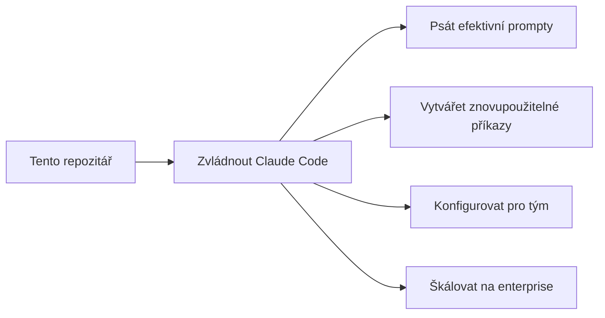
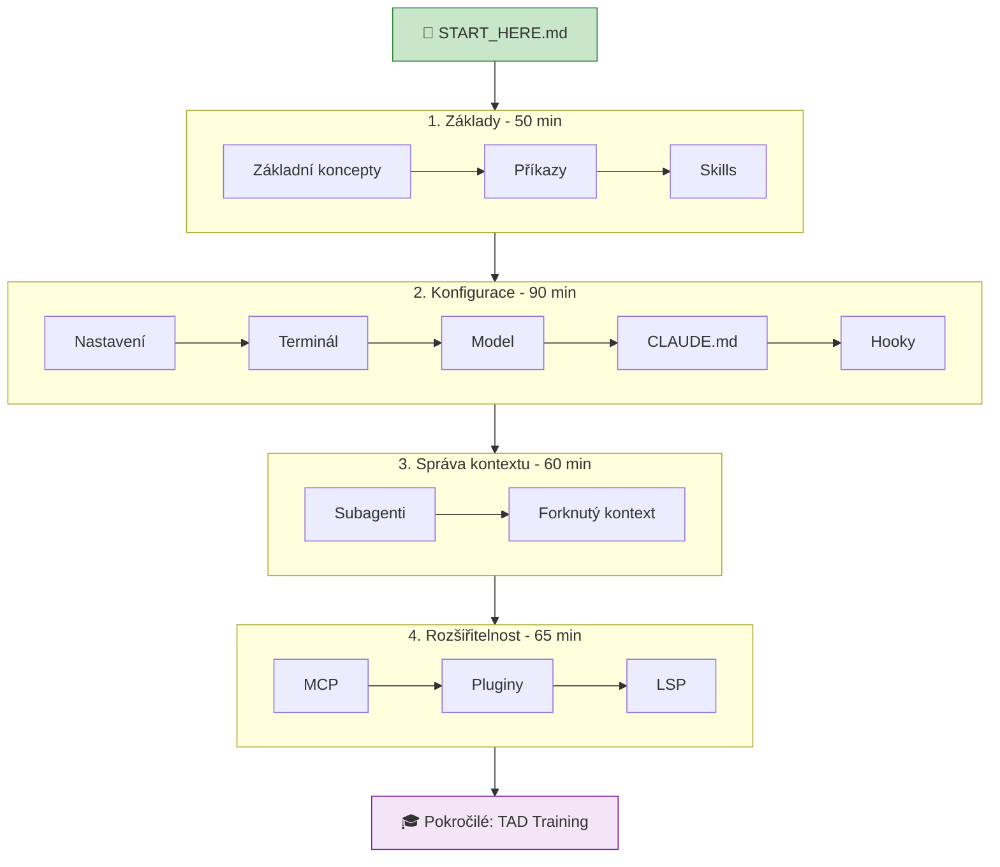
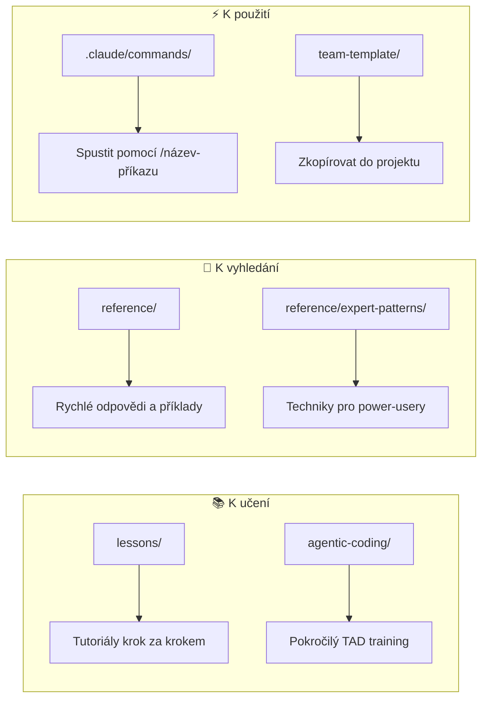

# Agentic Engineer Playbook - Mapa učení

> Vizuální průvodce pro vývojáře učící se Claude Code

## Changelog

| Verze | Datum | Změny |
|-------|-------|-------|
| 1.0 | 2026-01-22 | První verze - základní mapa učení |

---

## Co tento repozitář učí

---

## Cesta učení

---

## Rychlý přehled: Kde co najít

---

## Vyber si svou cestu

| Cesta | Čas | Pro koho | Začni s |
|-------|-----|----------|---------|
| **Rychlý start** | 1 hodina | Chci být rychle produktivní | Lekce 01, 04, 05, 02 |
| **Kompletní kurz** | 4.5 hodiny | Chci úplné pochopení | Všechny lekce 01-11 |
| **Power User** | 2 hodiny | Už znám základy | Lekce 04a-c, 07-08, expert-patterns |

---

## Přehled adresářů

| Složka | Co obsahuje |
|--------|-------------|
| `lessons/` | 11 tutoriálů ve 4 sekcích |
| `reference/` | Dokumenty pro rychlé vyhledání, příklady, vzory |
| `agentic-coding/` | Enterprise-scale training (TAD) |
| `.claude/` | Funkční příkazy, které můžeš spustit |
| `team-template/` | Připravená konfigurace pro tým |

